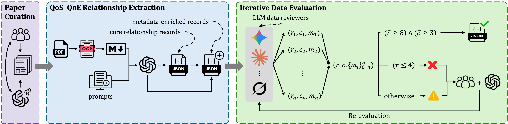
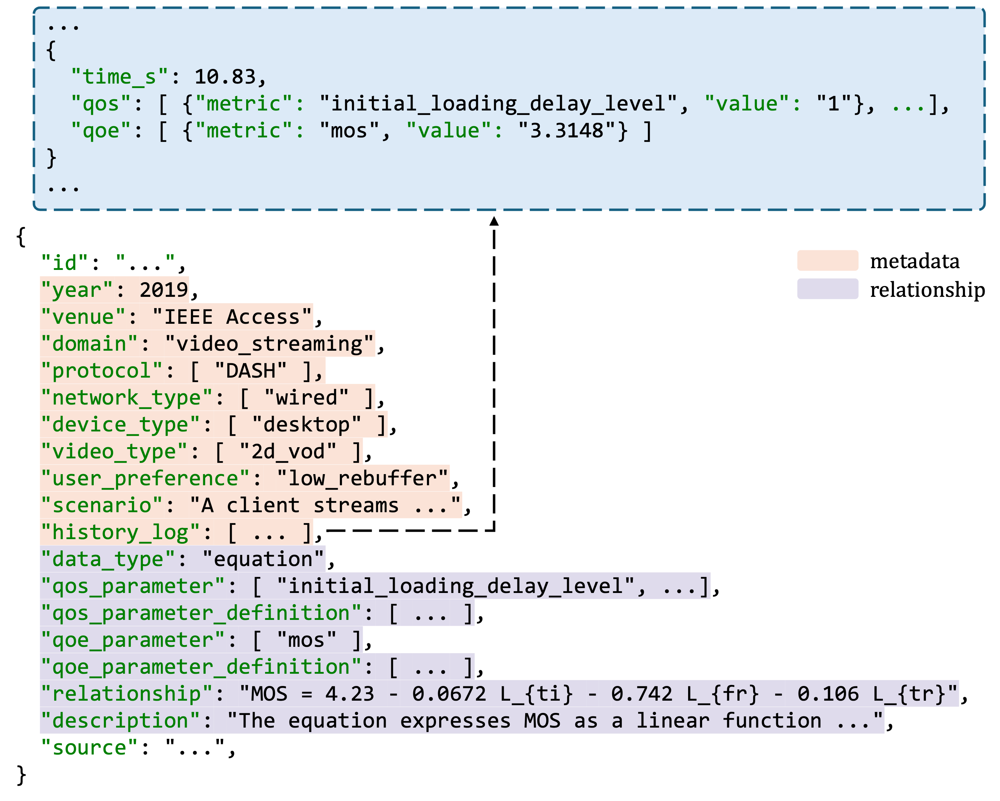

# QoS-QoE Translation with Large Language Model

This repository contains the data construction pipeline for the QoS-QoE Translation dataset. The pipeline builds source-grounded structured QoS-QoE relationship records from research papers, with a current focus on video streaming. It converts curated papers into machine-readable intermediate files, extracts core QoS-QoE relationships from equations, tables, and figures, enriches them with contextual metadata, and improves record quality through iterative multi-reviewer evaluation.

## Pipeline Overview



The pipeline consists of Three main stages:
1. paper curation
2. QoS-QoE relationship extraction and metadata enrichment
4. iterative data evaluation

## Dataset

The QoS-QoE Translation dataset is a source-grounded dataset of structured QoS-QoE relationships extracted from the literature, currently focused on video streaming. Each record preserves the extracted relationship together with parameter definitions, supporting evidence, and contextual metadata for interpretability and reproducibility.

Download the dataset from [Google Drive](https://drive.google.com/file/d/1vvyhoRU6q14A5hmoux8G1j288eGlf2YB/view?usp=drive_link).



## Build a QoS-QoE Translation dataset

This section describes how to run the full data construction pipeline, from curated papers to final reviewed JSON records.

### Folder layout

```txt
src/
├── main.py
├── relationship_extraction.py
├── metadata_enrichment.py
├── data_evaluation.py
├── data_reviewers/
│   ├── claude.py
│   ├── gemini.py
│   └── grok.py
└── prompts/
    ├── relationship_extraction.txt
    └── data_evaluation.txt
```

### Quick Start

Before running the pipeline, prepare:
- export the required API keys:
```bash
export OPENAI_API_KEY="..."
export XAI_API_KEY="..."
export ANTHROPIC_API_KEY="..."
export GEMINI_API_KEY="..."
```
- a curated paper markdown file
- a paper metadata CSV containing paper-level metadata such as year and venue

The automated pipeline starts from curated paper inputs and then runs relationship extraction, metadata enrichment, and iterative data evaluation. The `paper_csv` file serves as a metadata lookup table and is used to attach paper-level fields such as `year` and `venue` by matching the markdown filename id (for example, `2.md`) to the `Index` column in the CSV. And you can use our paper curation from [Google Drive](https://docs.google.com/spreadsheets/d/1zduEVc4zKwfyO3qVBSK_dQavNO118-TX/edit?usp=sharing&ouid=117268005957559601952&rtpof=true&sd=true)

```bash
python src/main.py \
  --md path/to/your/paper.md \                              # curated paper markdown
  --relationship_prompt src/prompts/relationship_extraction.txt \   # extraction prompt
  --paper_csv path/to/your/paper_metadata.csv \            # paper-level metadata lookup
  --metadata_prompt src/prompts/metadata_enrichment.txt \ # metadata enrichment prompt
  --evaluation_system_prompt src/prompts/data_evaluation.txt \      # evaluation prompt
  --relationships_out path/to/your/relationship_extraction.json \    # core extraction output
  --enriched_out path/to/your/metadata_enrichment.json \   # metadata-enriched output
  --evaluation_out path/to/your/data_evaluation.json \     # final evaluated output
  --reviewers claude,gemini,grok \
  --claude-model claude-haiku-4-5-20251001 \
  --gemini-model gemini-2.5-flash-lite \
  --grok-model grok-4.20-0309-reasoning
```

### Output

After running the command, the pipeline generates:

- `path/to/your/relationship_extraction.json`
- `path/to/your/metadata_enrichment.json`
- `path/to/your/data_evaluation.json`